<a href="https://jayanth-sde.vercel.app"><picture><source media="(prefers-color-scheme: dark)" srcset="assets/header-dark.svg"></picture></a>

  <a href="https://jayanth-sde.vercel.app"><b>Portfolio</b></a>&nbsp;&nbsp;·&nbsp;&nbsp;<a href="https://linkedin.com/in/jayanth-sde"><b>LinkedIn</b></a>&nbsp;&nbsp;·&nbsp;&nbsp;<a href="https://huggingface.co/Reflex-jr"><b>Hugging Face</b></a>&nbsp;&nbsp;·&nbsp;&nbsp;<a href="mailto:jayanth.sde.fsd@gmail.com"><b>jayanth.sde.fsd@gmail.com</b></a>&nbsp;&nbsp;·&nbsp;&nbsp;<a href="https://github.com/sponsors/Jayanth-reflex"><b>Sponsor ♥</b></a>

### About me

I'm a senior software engineer with four years of building generative AI systems and the backend services underneath them. I've shipped a retrieval-augmented generation (RAG) platform on AWS Bedrock that serves millions of users, fine-tuned a domain model that cut third-party model spend by 80%, and built Java microservices for 50,000+ concurrent users.

**Right now** I'm designing governance workflows that observe and evaluate AI agents at scale, including an LLM-as-judge proof of concept that evaluates 10+ agentic workflows.

**Outside work** I fine-tune open models, most recently a Qwen3.6-35B-A3B fine-tune on a single AMD MI300X that is [published on Hugging Face](https://huggingface.co/Reflex-jr), and I send fixes upstream to the open source tools I use.

### Impact

<picture>
  <source media="(prefers-color-scheme: dark)" srcset="assets/impact-dark.svg">
  
</picture>

### Top 4 open source contributions

My four best recent fixes sent upstream, most of them found while building my own projects.

<!-- oss:start -->

<a href="https://github.com/deepset-ai/haystack/pull/12988"><picture><source media="(prefers-color-scheme: dark)" srcset="assets/oss/deepset-ai-haystack-12988-dark.svg"></picture></a>
<a href="https://github.com/NandhaKishorM/laya/pull/624"><picture><source media="(prefers-color-scheme: dark)" srcset="assets/oss/nandhakishorm-laya-624-dark.svg"></picture></a>
<a href="https://github.com/koala73/worldmonitor/pull/2455"><picture><source media="(prefers-color-scheme: dark)" srcset="assets/oss/koala73-worldmonitor-2455-dark.svg"></picture></a>
<a href="https://github.com/miurahr/py7zr/pull/754"><picture><source media="(prefers-color-scheme: dark)" srcset="assets/oss/miurahr-py7zr-754-dark.svg"></picture></a>

Top 4 of my most recent upstream pull requests · 2 merged, 2 in review · cards refresh daily from the GitHub API
<!-- oss:end -->

### Experience

**Senior Software Engineer** · AI governance and agent evaluation · Jul 2026 – present
- Designing governance workflows for the observability and evaluation of AI agents at scale
- Built an LLM-as-judge proof of concept that evaluates 10+ agentic workflows
- Trained 20+ developers on AWS and Azure AI services

**Senior Developer** · production generative AI platform · Sep 2025 – Jun 2026
- Built a RAG platform on AWS Bedrock with semantic and vector search and Responsible AI guardrails, serving millions of users and cutting application completion time by 60%
- Cut hallucinations by 60% across LangGraph agent workflows through prompt templates and systematic prompt and model evaluation
- Fine-tuned, evaluated and deployed a domain small language model with PyTorch, Hugging Face Transformers and Weights & Biases on Docker and Kubernetes, cutting third-party model costs by 80%
- Unified modern identity management and legacy JWT users under one role-based access model, enforced CSP and HSTS, and moved hardcoded secrets into AWS Systems Manager
- Mentored 3 developers and trained 15+ engineers on RAG and agentic workflows

**Software Engineer** · enterprise backend and integrations · Feb 2022 – Mar 2025, including a trainee period
- Built a RAG chatbot that grounds answers in enterprise content, and an integration layer across 10+ systems using REST, SOAP and Apache Kafka pipelines
- Designed 4 Spring Boot microservices serving 50,000+ concurrent users on Docker and Kubernetes
- Secured APIs with Azure API Management, OAuth2 and JWT, cutting security incidents by 60%; built React and TypeScript dashboards over 25+ APIs
- Tuned MySQL schemas with JPA and Hibernate for 35% faster responses, with JUnit5 suites at 90%+ coverage

**Recognition** · Won a Vista-backed hackathon with an agentic hiring system that shortlists, interviews and recommends candidates across 1M+ applicant records, cutting manual screening by 90% · Rising Star award for AI integration delivery · Google Generative AI, AWS and Microsoft Azure certified · B.Tech, JNTUH (MRCET), 2022

### Projects

<table>
<tr>
<td width="50%" valign="top">

**[amd-hackathon-2026](https://github.com/Jayanth-reflex/amd-hackathon-2026)** 
A solo 48-hour fine-tune of Qwen3.6-35B-A3B on one AMD MI300X: LoRA training, merge, abliteration, then a 9-quant GGUF ladder [on Hugging Face](https://huggingface.co/Reflex-jr/Qwen3.6-35B-A3B-Domain-Aggressive-GGUF). Safety policy runs at the application layer with Llama Guard 3. 
PyTorch · PEFT / LoRA · ROCm · vLLM · Weights & Biases

</td>
<td width="50%" valign="top">

**[lastbite-swiggy-mcp](https://github.com/Jayanth-reflex/lastbite-swiggy-mcp)** 
Order food from Swiggy in plain English. An agent on Swiggy's MCP server builds the cart, then walks you through three confirmation gates and a 30-second grace timer before anything is placed. [Live demo](https://swiggy-mcp.vercel.app). 
TypeScript · Next.js · LangGraph · MCP · Redis · Postgres

</td>
</tr>
<tr>
<td width="50%" valign="top">

**[domain-flipper-agent](https://github.com/Jayanth-reflex/domain-flipper-agent)** 
LangGraph agents that read trends from the open web, generate and value domain names, check trademarks and availability, and wait for a human to approve before acting. Each external service sits behind its own MCP server. 
Python · LangGraph · Claude API · FastMCP · Postgres

</td>
<td width="50%" valign="top">

**[file-password-remover](https://github.com/Jayanth-reflex/file-password-remover)** 
Removes passwords from PDF, Office, ZIP and 7-Zip files you own, entirely offline, and re-opens every output to verify it before writing. Building it turned up the py7zr hang I fixed upstream. 
Python · pikepdf · msoffcrypto · py7zr

</td>
</tr>
<tr>
<td width="50%" valign="top">

**[global-health-radar](https://github.com/Jayanth-reflex/global-health-radar)** 
A worldwide disease tracker built as Spring Boot microservices behind a JWT gateway, with a transactional outbox, PostGIS and two levels of caching, running on free hosting. 
Java 25 · Spring Boot 4 · Next.js 16 · Supabase · Redis

</td>
<td width="50%" valign="top">

**[reflex-whoop](https://github.com/Jayanth-reflex/reflex-whoop)** 
An iOS app that keeps WHOOP data on your phone: it syncs the WHOOP API and records live heart rate straight from the band over read-only Bluetooth, into an archive that outlives the subscription. 
Swift · SwiftUI · Core Bluetooth · GRDB (SQLite)

</td>
</tr>
</table>

### Tech stack

<picture>
  <source media="(prefers-color-scheme: dark)" srcset="assets/stack-dark.svg">
  
</picture>

### GitHub activity

<picture>
  <source media="(prefers-color-scheme: dark)" srcset="assets/activity-dark.svg">
  
</picture>

### Let's talk

I'm open to senior and staff individual-contributor roles in LLM engineering, AI platforms and backend infrastructure. I'm based in Hyderabad and open to remote work or relocation, and I reply to every message within 24 hours.

**[jayanth.sde.fsd@gmail.com](mailto:jayanth.sde.fsd@gmail.com)** · **[LinkedIn](https://linkedin.com/in/jayanth-sde)** · **[Portfolio](https://jayanth-sde.vercel.app)**

Every card on this page is an SVG drawn by <a href="scripts/build.mjs">scripts/build.mjs</a> and refreshed daily by GitHub Actions. No third-party image services.
